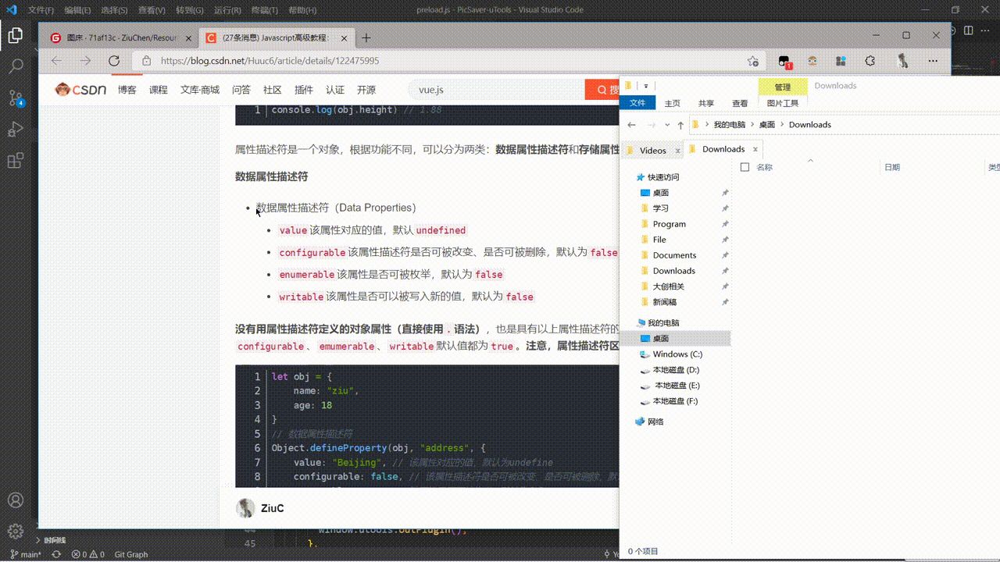

### :sparkles: 核心功能

* 识别剪切板内容，并保存到指定路径
* 支持保存图片、文本

### :gear: 可配置项

* 修改文件默认保存的位置
* 修改保存时的文件名（支持格式化表达式）
* 设置保存文件时是否弹出文件窗口

| 表达式            | 含义       |
| ----------------- | ---------- |
| `{Y}`             | 年         |
| `{M}`             | 月         |
| `{D}`             | 日         |
| `{h}`             | 小时       |
| `{m}`             | 分钟       |
| `{s}`             | 秒         |
| `{ms_time_stamp}` | 毫秒时间戳 |
| `{s_time_stamp}`  | 秒时间戳   |

### :speech_balloon: 匹配关键词

* 匹配图片、任意文本
* 修改设置

### :camera_flash: 效果演示

* 通过全局快捷键调用插件
* 选中图片/文本后唤起超级面板
* 复制图片/文本到剪切板后调用uTools

